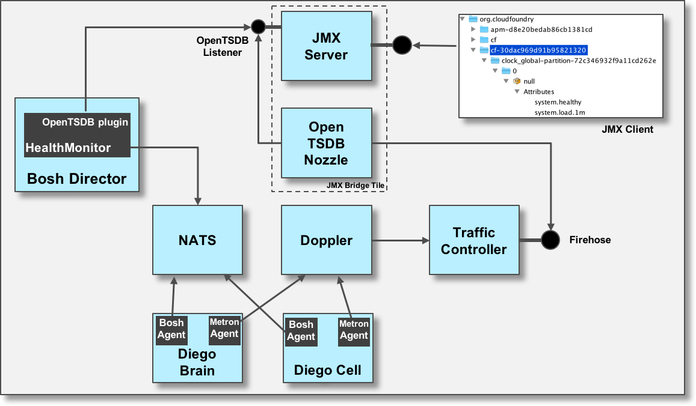
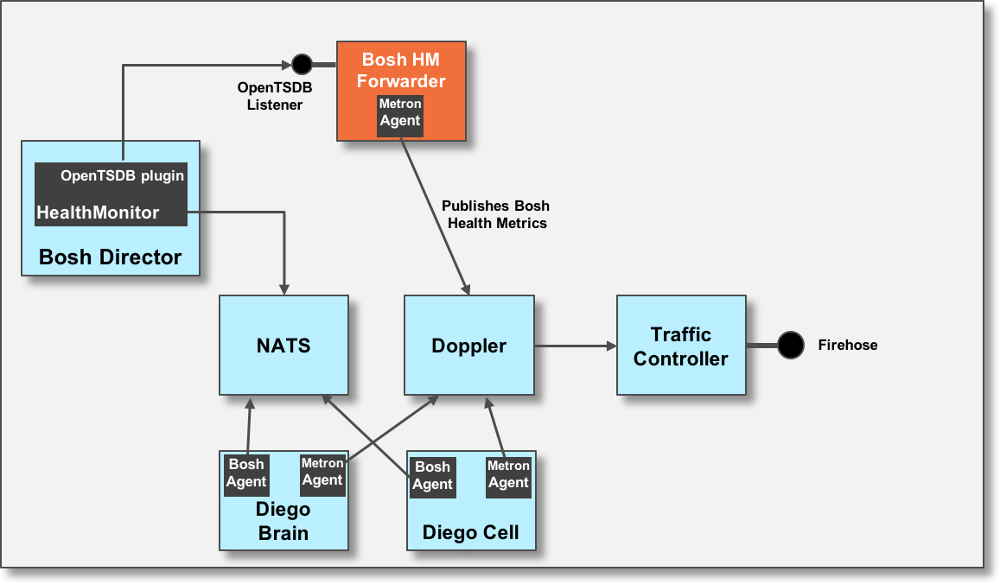
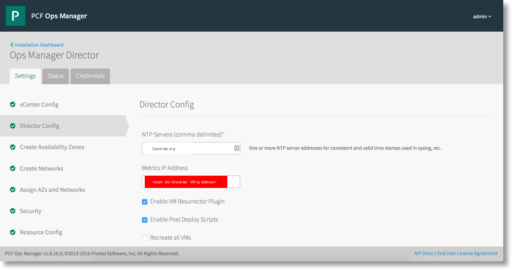

## Cloud Foundry VM Health Metrics in the Firehose - Deploying the Bosh Health Metrics Forwarder

In your cloud native journey using Cloud Foundry, you are often trying to increase your maturity on monitoring the health of your platform. Likely, you are also using the the goodness of the firehose/nozzle architecture integrated with your monitoring tool to visualize and alert on various Cloud Foundry metrics, like the `rep.capacityRemaningMemory` metric. Have you noticed that the Cloud Foundry VM metrics, like CPU utilization for the Cloud Controller, are missing from the firehose? Not to worry as there is something called the Bosh Health Metrics Forwarder that solves this problem.

_Sidebar: Ever wonder what key metrics to monitor in Cloud Foundry? Check out [Rohit Kelapure's](https://www.blogger.com/profile/12988550581111360779) post on the [top 10 KPIs in Cloud Foundry](http://cloud.rohitkelapure.com/2016/06/top-10-kpis-cloud-foundry.html)._

##### What is the Bosh Health Metrics Forwarder?

The [boshhmforwarder](https://github.com/cloudfoundry/loggregator/tree/develop/src/boshhmforwarder), part of the [Cloud Foundry Loggregator](https://github.com/cloudfoundry/loggregator) release (since [version 55](https://github.com/cloudfoundry/loggregator/blob/9b8d7b04b79ff9ce46a30def809457436dd674a6/releases/loggregator/loggregator-55.yml)), forwards the health metrics from Cloud Foundry VMs to the firehose.

To better understand how the `boshhmforwarder` works, we should look at how the Cloud Foundry VM health metrics are sent to [Pivotal's JMX Bridge tile](https://network.pivotal.io/products/ops-metrics).



Each bosh managed VM in a Cloud Foundry foundation has a bosh agent that collects the VM's health metrics and publishes to NATS. The [health monitor](http://bosh.io/docs/bosh-components.html#health-monitor) consumes the metrics from the NATS messages bus and uses it's [plugin architecture](http://bosh.io/docs/monitoring.html ) to send the metrics to an OpenTSDB endpoint on the JMX VM of the JMX Bridge tile. Now VM health metrics, like `system.healthy`, show up in the JMX tree.

##### How does the Bosh Health Metrics Forwarder work?



The `boshhmforwarder` can be deployed as a separate [bosh release](https://bosh.io/docs/release.html) using your foundation's existing [bosh director](https://bosh.io/docs/bosh-components.html#director). This bosh release contains a single VM with an [OpenTSDB listener](http://opentsdb.net) and a `metron agent` job.  The `metron agent` is configured to send the bosh health metric events, received on the `OpenTSDB listener`, to the `doppler` VMs in your Cloud Foundry foundation.

##### Deploying the Bosh Health Metrics Forwarder

Going from zero to bosh health metrics in the firehose is just a few steps. These steps are:

1. Build your manifest using the sample below (the lines with << >> are informational and should be removed):
```
name: boshhmforwarder

<<get using bosh status>>
director_uuid: e4cbdf25-9131-4972-a92f-a5485071966f

releases:
- name: cf
  <<get using bosh releases>>
  version: 239.0.26
- name: loggregator
  version: latest

stemcells:
- alias: trusty
  os: ubuntu-trusty
  version: latest

instance_groups:
- name: boshhmforwarder
  instances: 1
  stemcell: trusty
  <<get name where you want to deploy from your Ops Manager Director>>
  azs: myaz
  vm_type: medium
  networks:
  <<get name where you want to deploy from your Ops Manager Director>>
  - name: myNetwork
    static_ips:
    <<get from bosh cloud-config, from an ip not used>>
    - 192.168.0.99
  jobs:
  - name: boshhmforwarder
    release: loggregator
  - name: metron_agent
    release: cf
  lifecycle: service
  properties:
    boshhmforwarder:
      incoming_port: 13321
    loggregator_endpoint:
      shared_secret: <<doppler shared secret>>
    metron_endpoint:
      shared_secret: <<doppler shared secret>>
    metron_agent:
      deployment: cf
    loggregator:
      etcd:
        machines:
        <<get from bosh deployments <cf deployment>, all ip addreses if etcd jobs>>
        - 192.168.0.57
        - 192.168.0.58
        - 192.168.0.59

update:
  canaries: 1
  canary_watch_time: 30000-300000
  update_watch_time: 30000-300000
  max_in_flight: 1
  max_errors: 2
  serial: true

```

2. Upload the latest [loggregator release](https://bosh.io/releases/github.com/cloudfoundry/loggregator?all=1).
3. `bosh deploy` your `boshhmforwarder` manifest.
4. Add the _ip address_ of the `boshhmforwarder` VM to the `Ops Manager Director > Director Config > Metrics IP Address` field and _Apply_ changes.



In looking at the sample manifest, your are probably thinking "why is the `incoming_port=13321` for the `boshhmforwarder` property?" Great question. The answer lies in the fact that PCF's Ops Manager helps you manage an _opinionated_ representation of what you can do in the `bosh director manifest`. If you are using bosh to manage Cloud Foundry OSS, there are many more degrees of freedom to manage the foundation. With that [_"great power comes great responsibility"_](https://en.wikipedia.org/wiki/Uncle_Ben#.22With_great_power_comes_great_responsibility.22). In the OSS platform, you can directly set the port, along with the ip address, in the `jobs: > bosh > hm: > tsdb:` section of the bosh director manifest. In the Ops Manager's _opinion_, that port is `13321` and thus when you set the ip address per _step 4_ above, you are telling the `bosh health monitor` to send the health metric events to the `boshhmforwarder's OpenTSDB listener` on port `13321`.

##### What do these metrics look like coming out of the firehose?

Using the [cf nozzle-plugin](https://github.com/cloudfoundry/firehose-plugin), you can quickly see what the `boshhmforwarder` emits from the firehose. Below is a snapshot of metrics emitted for the `cloud controller`. These same metrics will show up for each VM.

```
origin:"bosh-hm-forwarder" eventType:ValueMetric timestamp:1476942066000000000 deployment:"cf-1eb36277d51e7d6ba29f" job:"cloud_controller" index:"0" ip:"" valueMetric:<name:"system.load.1m" value:0.17 unit:"Load" >

origin:"bosh-hm-forwarder" eventType:ValueMetric timestamp:1476942066000000000 deployment:"cf-1eb36277d51e7d6ba29f" job:"cloud_controller" index:"0" ip:"" valueMetric:<name:"system.cpu.wait" value:0.1 unit:"Load" >

origin:"bosh-hm-forwarder" eventType:ValueMetric timestamp:1476942066000000000 deployment:"cf-1eb36277d51e7d6ba29f" job:"cloud_controller" index:"0" ip:"" valueMetric:<name:"system.cpu.user" value:0.9 unit:"Load" >

origin:"bosh-hm-forwarder" eventType:ValueMetric timestamp:1476942066000000000 deployment:"cf-1eb36277d51e7d6ba29f" job:"cloud_controller" index:"0" ip:"" valueMetric:<name:"system.cpu.sys" value:0.5 unit:"Load" >

origin:"bosh-hm-forwarder" eventType:ValueMetric timestamp:1476942066000000000 deployment:"cf-1eb36277d51e7d6ba29f" job:"cloud_controller" index:"0" ip:"" valueMetric:<name:"system.disk.system.percent" value:42 unit:"Percent" >

origin:"bosh-hm-forwarder" eventType:ValueMetric timestamp:1476942066000000000 deployment:"cf-1eb36277d51e7d6ba29f" job:"cloud_controller" index:"0" ip:"" valueMetric:<name:"system.disk.system.inode_percent" value:32 unit:"Percent" >

origin:"bosh-hm-forwarder" eventType:ValueMetric timestamp:1476942066000000000 deployment:"cf-1eb36277d51e7d6ba29f" job:"cloud_controller" index:"0" ip:"" valueMetric:<name:"system.mem.percent" value:19 unit:"Percent" >

origin:"bosh-hm-forwarder" eventType:ValueMetric timestamp:1476942066000000000 deployment:"cf-1eb36277d51e7d6ba29f" job:"cloud_controller" index:"0" ip:"" valueMetric:<name:"system.mem.kb" value:782700 unit:"Kb" >

origin:"bosh-hm-forwarder" eventType:ValueMetric timestamp:1476942066000000000 deployment:"cf-1eb36277d51e7d6ba29f" job:"cloud_controller" index:"0" ip:"" valueMetric:<name:"system.swap.percent" value:0 unit:"Percent" >

origin:"bosh-hm-forwarder" eventType:ValueMetric timestamp:1476942066000000000 deployment:"cf-1eb36277d51e7d6ba29f" job:"cloud_controller" index:"0" ip:"" valueMetric:<name:"system.swap.kb" value:0 unit:"Kb" >

origin:"bosh-hm-forwarder" eventType:ValueMetric timestamp:1476942066000000000 deployment:"cf-1eb36277d51e7d6ba29f" job:"cloud_controller" index:"0" ip:"" valueMetric:<name:"system.disk.ephemeral.percent" value:7 unit:"Percent" >

origin:"bosh-hm-forwarder" eventType:ValueMetric timestamp:1476942066000000000 deployment:"cf-1eb36277d51e7d6ba29f" job:"cloud_controller" index:"0" ip:"" valueMetric:<name:"system.disk.ephemeral.inode_percent" value:2 unit:"Percent" >

origin:"bosh-hm-forwarder" eventType:ValueMetric timestamp:1476942066000000000 deployment:"cf-1eb36277d51e7d6ba29f" job:"cloud_controller" index:"0" ip:"" valueMetric:<name:"system.healthy" value:1 unit:"b" >

origin:"bosh-hm-forwarder" eventType:ValueMetric timestamp:1476942066000000000 deployment:"cf-1eb36277d51e7d6ba29f" job:"cloud_controller" index:"0" ip:"" valueMetric:<name:"system.disk.persistent.percent" value:0 unit:"Percent" >

origin:"bosh-hm-forwarder" eventType:ValueMetric timestamp:1476942066000000000 deployment:"cf-1eb36277d51e7d6ba29f" job:"cloud_controller" index:"0" ip:"" valueMetric:<name:"system.disk.persistent.inode_percent" value:0 unit:"Percent" >
```

##### Increase your Cloud Foundry platform monitoring maturity

One of my favorite metrics emitted from the `boshhmforwarder` is the `system.healthy` metric. With a value of `1` or `0`, you can quickly monitor the average health of a component. As an example, if I have an average of `gorouter system.healthy < 1` for my 3 `gorouters` for longer than 5 minutes, an alert should be sent out indicating that bosh recovering VMs is not working.

As our cloud native journey continues to mature, we should strive to get better at monitoring our Cloud Foundry platform. Deploying the `boshhmforwarder` to get Cloud Foundry VM metrics through the firehose and alerting on those metrics is a great way to achieve another step monitoring maturity.
